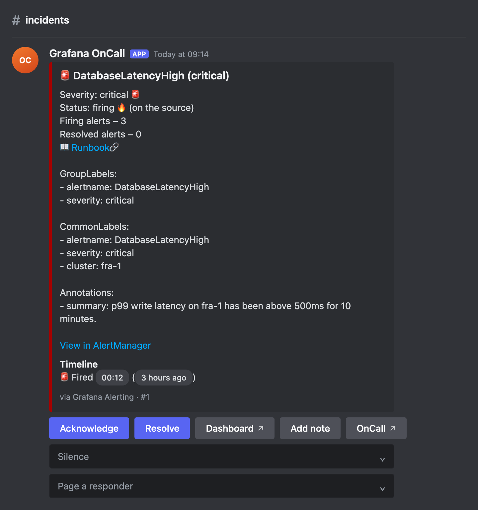
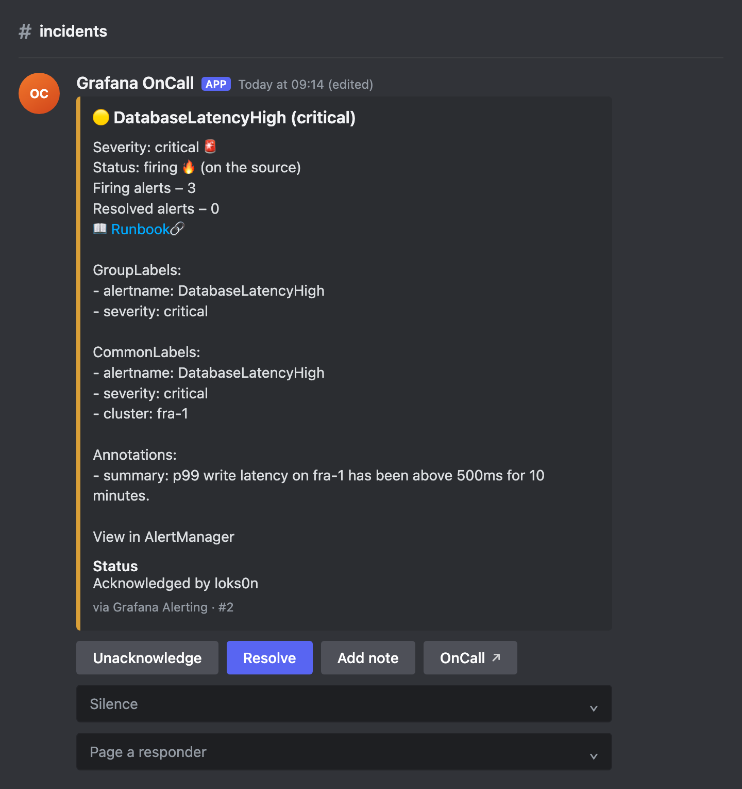
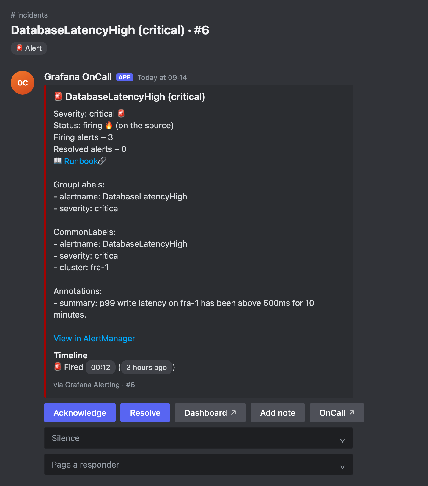
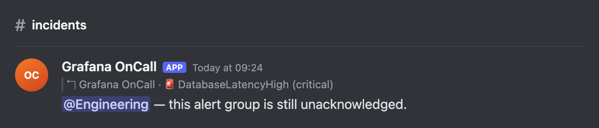
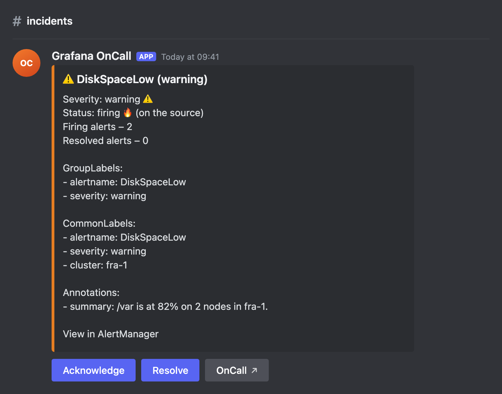
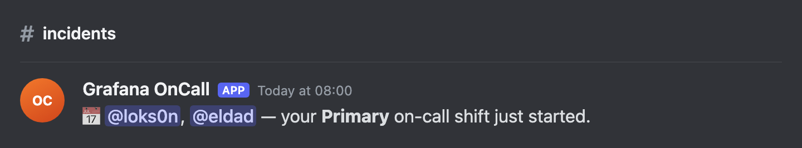

# Discord integration for Grafana OnCall

The Discord integration posts every alert group to a Discord channel as an embed with Acknowledge and Resolve
buttons, and keeps that message up to date as the alert group changes state — whether the change came from Discord,
the OnCall UI, Slack or the API. Once a user links their Discord account, Discord is also selectable as a step in
escalation chains and personal notification policies.

At the moment, this integration is only available for OSS installations.



The card carries the same controls Slack's does: acknowledge and resolve, a **Silence** menu of durations, a
**Page a responder** menu that adds somebody to the escalation, and **Add note** for a resolution note. Where the
alert carries a source link, a **Source** button opens it, and an alert whose annotations name a dashboard gets a
**Dashboard** button too. The footer says which integration the alert came from,
which alert group it is, and how many alerts the group holds.

The **Timeline** field is written in Discord's own timestamps, so everyone reads it on their own clock and in their
own timezone — "Fired 00:12 (3 hours ago)", then who acknowledged it and when, then how long it took to resolve.

Acknowledging or resolving — from Discord or anywhere else — edits the same message in place:



## Before you begin

Create a Discord application at <https://discord.com/developers/applications>, add a bot to it, and invite the bot to
your server with the `bot` scope and the **Send Messages** and **Embed Links** permissions.

Set the following environment variables on the engine and the celery workers:

| Variable | Value |
| --- | --- |
| `FEATURE_DISCORD_INTEGRATION_ENABLED` | `True` |
| `DISCORD_BOT_TOKEN` | the bot token from the application's **Bot** page |
| `DISCORD_PUBLIC_KEY` | the **Public Key** from the application's **General Information** page |

Add `discord` to `CELERY_WORKER_QUEUE` so the alert group messages are actually posted.

## Receive button presses

Discord delivers button presses over HTTP rather than a gateway connection. On the application's **General
Information** page, set the **Interactions Endpoint URL** to:

```text
https://<your-oncall-engine>/api/internal/v1/discord/interaction/
```

Discord verifies the endpoint by sending a signed ping, which OnCall answers using `DISCORD_PUBLIC_KEY`. Requests
that are not signed by your application are rejected with a 401.

## Connect a Discord channel

Turn on Developer Mode in Discord (**Settings → Advanced**), right-click the channel you want alerts in and choose
**Copy Channel ID**. Then, in Grafana OnCall, go to **Settings → ChatOps → Discord**, click **Add Discord channel**
and paste it in.

**Make default** marks the channel alert groups are posted to. A route can override it: on an integration's route,
switch on **Post to Discord channel** and pick another one.

## Use a forum channel instead

Connect a **forum channel** and each alert group becomes its own post rather than a message in a shared channel:
discussion lands beside the card, and the channel list becomes a list of open alerts. Nothing extra to configure —
OnCall reads the channel's type when you connect it and behaves accordingly.

If the forum has tags named after a status — **Firing**, **Acknowledged**, **Silenced**, **Resolved** — or after a
severity — **Critical**, **Warning**, **Info** — OnCall applies the matching ones and keeps them current, which turns
the sidebar into a triage view you can filter. Tags you do not create are simply not applied. Create them with the
same names to opt in; rename them and OnCall stops.

A tag is read a word at a time, so the decoration around the word that matters does not stop it matching and tags
can read the way you want them to in Discord: **🔥 Firing**, **Resolved ✅**, **Status: 🔥 Firing** and
**P1 Critical** all name the state they end in. Only a whole word counts — a tag named **Informational** names
nothing.

The tags matching the cards read well as a set, if you want somewhere to start:

```text
🔥 Firing      🟡 Acknowledged   🔕 Silenced   ✅ Resolved
🚨 Critical    ⚠️ Warning        📘 Info
```

One emoji to avoid: **ℹ️** is a lowercase letter to Unicode rather than a symbol, and Discord stores the name
without the selector that marks it as an emoji, so **ℹ️ Info** is a word that is not "info" and names nothing.
Cards use 📘 for info severity for the same reason.

A forum set up against an earlier version has a tag named **Alert**, which nothing is named any more: rename it to
**Firing** or **Critical**, whichever you meant it to be. Until you do, its posts keep whichever tag they were last
given — an unmatched name leaves a post's tags alone rather than clearing them.

OnCall reads the forum's tags when you connect the channel, so re-connect it after adding or renaming any. Deleting
a tag that OnCall still has in that list leaves posts untagged rather than erroring — Discord accepts an unknown tag
id and applies nothing.

Nothing archives a post deliberately — Discord archives quiet posts on its own, and OnCall unarchives a post before
editing it, so a reopened alert comes back to the active list by itself.



The bot needs **Create Public Threads** and **Send Messages in Threads** in a forum, on top of the permissions above.

## Escalate to a role

A route can name a Discord role to shout at when OnCall escalates. Set **escalating to role** on the route to a role
id (Developer Mode → right-click the role → **Copy Role ID**). When an escalation chain reaches **Notify Whole
Channel** or **Notify Group**, OnCall replies to the alert group's card mentioning that role:



This is deliberately only the loud part. Reaching the right people is still the escalation chain's job, through
their own notification policies, so that who gets woken respects who is actually on call. Nothing is posted if the
alert group has already been acknowledged, silenced or resolved by the time the step runs.

A resolution note created from the OnCall UI or the public API is posted the same way: beside the card, in the
forum post or as a reply in a text channel. Mentions stay off. The alert group's `permalinks.discord` is a URL
to that card.

## Split critical alerts from the rest

A route also chooses how loud its alert groups read: **🚨 Critical**, **⚠️ Warning** or **📘 Info**. Set it to
warning and a still-open group from that route is amber rather than red:



Severity lives on the route rather than in the payload, because which label means "wake somebody up" differs per
deployment — `severity=critical`, `incident=true`, a label of your own — and the route already decides where an
alert goes and who it pages. So a route matching `{{ payload.commonLabels.severity == "warning" }}` can post to
`#alerts-low`, read as a warning and skip escalation entirely, while everything else keeps the default channel and
an escalation chain.

Acknowledging outranks severity: once somebody owns the group, the card turns 🟡 whichever route it came in on.

## Register the slash command

Linking a Discord account to an OnCall user is done with a slash command, which has to be registered with the
application once per deployment (and again whenever it changes):

```bash
python manage.py register_discord_commands
```

## Link a Discord account

A button press acts as the OnCall user linked to the pressing Discord account, and a Discord notification step
mentions that account. To link one:

1. In OnCall, open your user profile and go to the **Discord Connection** tab. It shows a verification code, valid
   for ten minutes.
2. In Discord, run `/oncall-link` and paste the code as the `code` option. The reply is only visible to you.
3. Refresh the page. The **Discord** row of your profile now shows the linked account, with a button to unlink it.

Until an account is linked, a button press gets an ephemeral reply saying so, and a Discord notification step is
recorded as failed with "has not linked a Discord account".

## What the card cannot do

A Discord menu holds 25 options and, unlike Slack's, cannot group them. **Page a responder** therefore lists the
first 25 users of the organization by username; page anybody else from the OnCall UI. **Silence** has eleven
durations, so it is unaffected.

## Shift announcements

Every ten minutes OnCall checks each schedule for shifts that have just started and announces them in the default
Discord channel, mentioning whoever is going on call:



Someone on call without a linked Discord account is named in plain text rather than left out. Only shift starts are
announced: in a follow-the-sun rota every shift ending coincides with another starting, so "ended" messages would be
daily noise. Overrides and swaps announce too, because the announcement reads the schedule's final events rather
than its rotations.
